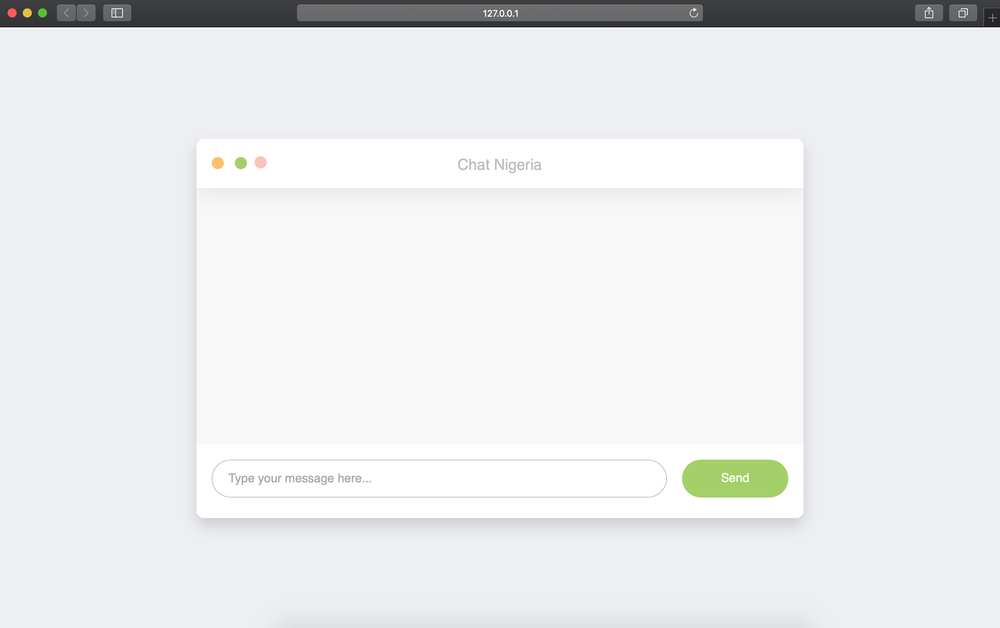

# Nigerian Constitution

## Proposal 
[Proposal](https://docs.google.com/document/d/1PZWHXIpK24NsSOaodSU-ES5yXiHfG2gmnOJDS996R7Q/edit#). You can view the deployed version at [https://nigerianbot.herokuapp.com/chat](https://nigerianbot.herokuapp.com/chat)

## To setup
Confirm that you have [virtual environment](https://docs.python-guide.org/dev/virtualenvs/#installing-pipenv) installed on your computer.

Then run

- `virtualenv env_constitution`

- `source env_constitution/bin/activate`

- `pip freeze > requirements.txt`

## To start the server run
`gunicorn -k gevent -w 1 app:app`

from your browser go to [http://127.0.0.1:8000/chat](http://127.0.0.1:8000/chat)

